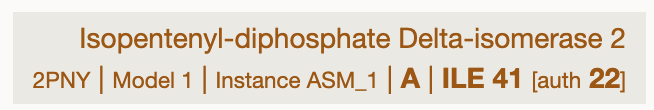

# How to make a design specification .yaml


**IMPORTANT:** ⚠️ All residue indices are specified **starting at 1** and we use the canonical mmcif residue index `label_asym_id`, and **not** the `auth_asym_id` author residue index! 
You can check the indexing in your mmcif file by opening it in https://molstar.org/viewer/, hovering over a residue, and checking the index on the bottom right. You will see something like this where **41 is the index we use, the auth id 22 is incorrect**:



After you constructed your `.yaml` file we recommend that you run the `check` command on it:
1. Run `boltzgen check example/vanilla_peptide_with_target_binding_site/beetletert.yaml`.  
2. Visualize the resulting mmcif file in a protein structure viewer (e.g. PyMOL, Chimera, or online: https://molstar.org/viewer/).
3. Your viewer should show the binding site in a different color than the rest of the target. 


# Example based explanation:
We provide many example `.yaml` files in the `example/` directory, including:

- [design_spec_showcasing_all_functionalities.yaml](design_spec_showcasing_all_functionalities.yaml)
- [vanilla_peptide_with_target_binding_site/beetletert.yaml](vanilla_peptide_with_target_binding_site/beetletert.yaml)
- [peptide_against_specific_site_on_ragc/rragc.yaml](peptide_against_specific_site_on_ragc/rragc.yaml)
- [nanobody/penguinpox.yaml](nanobody/penguinpox.yaml)
- [fab_targets/pdl1.yaml](fab_targets/pdl1.yaml)
- [denovo_zinc_finger_against_dna/zinc_finger.yaml](denovo_zinc_finger_against_dna/zinc_finger.yaml)
- [protein_binding_small_molecule/chorismite.yaml](protein_binding_small_molecule/chorismite.yaml)
- [small_molecule_from_file_and_smiles/4g37.yaml](small_molecule_from_file_and_smiles/4g37.yaml)

Small example of a protein design against a target protein without binding site specified:
```yaml
entities:
  # Designed protein with between 80 and 140 residues 
  # (The length is randomly sampled)
  - protein: 
      id: B
      sequence: 80..140

  # The target is extracted from a .cif file
  - file:
      path: hard_targets/6m1u.cif

      # Which chain in the .cif file to use as target (uses all chains if unspecified)
      include: 
        - chain:
            id: A
```

**IMPORTANT:** ⚠️ File references inside a yaml file (e.g. to cif files) are interpreted relative to the directory of the yaml file.


Example highlighting many (not all) functionalities:
```yaml
entities:
  # Specification of the target which is extracted from a .cif file
  - file:
      path: 8r3a.cif
      
      # Which chain and residues in the .cif file to use as target (uses all chains if unspecified)
      include: 
        - chain:
            id: A
            res_index: 2..50,55.. # residues between 2 and 50 and anything larger than 55
        - chain:
            id: B

      # Which regions of the target the design should or should NOT
      # bind to (this can be left unspecified, then we just bind anywhere)
      binding_types:
        - chain:
            id: A
            binding: 5..7,13
        - chain:
            id: B
            not_binding: "all" 
      
      # Which regions of the target should have their structure specified.
      # By default, everything is visibility 1 which means that the structure is specified.
      # If the visibility is 0, then the structure is not specified.
      structure_groups:
        - group:
            visibility: 1
            id: A
            res_index: 10..13
        - group:
            # The relative positioning of things in structure group 2
            # is not specified w.r.t to things in structure group 1
            visibility: 2 
            id: B
        # Overwrite the previous visibility setting and set it to 0 for res_index 13
        - group:
            visibility: 0
            id: A
            res_index: 13 

      # Optionally you can say that some residues in a loaded .cif file should also be redesigned.
      design:
        - chain:
            id: A
            res_index: 14..19

      # For designed regions you can say what secondary structure they should have
      secondary_structure:
        - chain:
            id: A
            loop: 14
            helix: 15..17
            sheet: 19

  # Specify a NON-designed protein chain
  - protein: 
      id: X
      sequence: AAVTTTTPPP

  # Specify a designed protein chain 
  # Numbers specify what is being designed
  - protein: 
      id: G
      # random number between 15 and 20 of designed residues (inclusive)
      sequence: 15..20AAAAAAVTTTT18PPP 

  # A designed helical peptides with WHL staple 
  # (see the constraints below that connect the peptide with the WHL ligand)
  - protein: 
      id: R
      # Random number of design residues between 3 and 5,
      # then a Cysteine, then 6 design residues, then ...
      sequence: 3..5C6C3 
  - ligand:
      id: Q
      ccd: WHL
  
  # A designed peptide with 17 residues
  - protein:
      id: H
      sequence: 17

  # specification for a designed peptide with two Cys and a disulfide bond (see constraints)
  - protein:
      id: S
      sequence: 10..14C6C3

constraints:
    # specify connections as if the minimum possible number of residues was sampled
  - bond:
      atom1: [R, 4, SG] # connection for a helical peptides with WHL staple  between small molecule and designed peptide
      atom2: [Q, 1, CK]
  - bond:
      atom1: [R, 11, SG] # connection for a helical peptides with WHL staple  between small molecule and designed peptide
      atom2: [Q, 1, CH]
  - bond:
      atom1: [S, 11, SG] # connection for a disulfide bond between Cys and Cys in designed peptide
      atom2: [S, 18, SG]

```


# Detailed Explanation

```yaml
entities:
  # Define proteins, ligands, and structure files
  - protein: ...
  - ligand: ...
  - file: ...

constraints:
  # Define bonds and total length constraints
  - bond: ...
  - total_len: ...
```

### Entities Section

The `entities` section defines all the components of your design:

#### Protein Sequences

Define custom protein sequences with design flexibility:

```yaml
entities:
  - protein:
      id: G                   # Unique identifier 
      sequence: 15..20AAAAAAVTTTT18PPP  # Mix of fixed residues and design regions
      binding_types: uuuuBBBuNNNuBuu    # Binding specifications (optional)
      secondary_structure: HHHLLLEEE     # Secondary structure constraints for designed regions (optional)
```

**Sequence notation:**
- `15..20` - Design between 15-20 residues (inclusive)
- `AAAA` - Fixed amino acid sequence
- `18` - Design exactly 18 residues
- `3..5C6C3` - Variable design residues, then fixed Cys, then more design

**Binding types:**
- `B` - Binding residue
- `N` - Non-binding residue  
- `u` - Unspecified (default)
- Can specify as string: `uuuuBBBuNNNuBuu`
- Or as ranges:
  ```yaml
  binding_types:
    binding: 5..7,13      # Residues 5-7 and 13 are binding
    not_binding: 9..11    # Residues 9-11 are non-binding
  ```

#### Ligands

Define small molecule ligands using CCD codes or SMILES:

```yaml
# Using Chemical Component Dictionary (CCD) code
entities:
  - ligand:
      id: [E, F] # specify list of IDs to copy the entity
      ccd: WHL
      binding_types: B

# Using SMILES string
entities:
  - ligand:
      id: Q
      smiles: 'N[C@@H](Cc1ccc(O)cc1)C(=O)O'
      binding_types: B
```

#### Structure Files

Include existing protein structures from PDB/mmCIF files:

```yaml
entities:
  - file:
      path: 7rpz.cif
      
      # Include specific chains
      include:
        - chain:
            id: A
        - chain:
            id: B
      
      # Include by proximity
      include_proximity:
        - chain:
            id: A
            res_index: 10..16
            radius: 35
      
      # Exclude specific regions
      exclude:
        - chain:
            id: A
            res_index: ..5    # Exclude residues 1-5
      
      # Reset residue numbering
      reset_res_index:
        - chain:
            id: A
```


# Advanced Options 

**Design regions:** Specify which residues to redesign

```yaml
entities:
  ...
  - file:
    ...
    design:
      - chain:
          id: A
          res_index: ..4,20..27  # Redesign residues 1-4 and 20-27
```

**Secondary structure constraints:**
```yaml
entities:
  ...
  - protein:
    ...
    secondary_structure:
      - chain:
          id: A
          loop: 1        # Residue 1 should be loop
          helix: 2..3    # Residues 2-3 should be helix
          sheet: 4       # Residue 4 should be sheet
```

**Structure visibility groups:**
```yaml
entities:
  ...
  - file:
    ...
    structure_groups:
      - group:
          visibility: 1    # Visibility level (0=hidden, 1=visible, 2=highlighted)
          id: A
          res_index: 10..16
```

**Design insertions:**
```yaml
entities:
  ...
  - file:
    ...
    design_insertions:
      - insertion:
          id: A
          res_index: 20              # Insert after residue 20
          num_residues: 2..9         # Insert 2-9 residues
          secondary_structure: HELIX  # UNSPECIFIED, LOOP, HELIX, or SHEET
```

**Binding type specifications:**
```yaml
entities:
  ...
  - protein:
    ...
    binding_types:
      - chain:
          id: A
          binding: 5..7,13
      - chain:
          id: B
          not_binding: "all"
```

### Constraints Section

Define structural constraints between components:

#### Bond Constraints

Create covalent bonds between specific atoms:

```yaml
constraints:
  - bond:
      atom1: [R, 4, SG]   # [chain_id, residue_number, atom_name]
      atom2: [Q, 1, CK]   # Connect sulfur of Cys-4 in chain R to atom CK in ligand Q
```

We now support constraints specifications of small molecules from the input file and from smiles. Check `examples/small_molecule_from_file_and_smiles/4g37.yaml`. Below is brief guidelines:
* Small molecules from the file: check `atom_name` from the CCD and specify it.
* Small molecules from the smiles: count index of target element from the smiles and specify its element type with index (e.g. C6, for 6th carbon from the smiles).

Here is a comprehensive list of all the keys from your YAML file with explanations for each.

***

### Top-Level Keys

* `entities`: The main list containing all molecular components of the system, such as proteins, ligands, or imported files.
* `constraints`: A list of rules or conditions to apply to the system, like specific bonds between entities or total length restrictions.

---

### Entity Types (Keys within the `entities` list)

* `protein`: Defines a protein entity.
* `ligand`: Defines a small molecule ligand.
* `file`: Specifies an external structure file (e.g., a `.cif` file) to import parts of the system from.

---

### Keys for `protein` Entities

* `id`: A unique identifier for the protein chain (e.g., 'A', 'G').
* `sequence`: Defines the amino acid sequence of the protein. This can include numbers to specify lengths of residues to be designed.
* `secondary_structure`: Specifies the secondary structure of the protein.
* `binding_types`: Defines which residues are involved in binding. Can be a string or a more detailed dictionary.
* `cyclic`: A boolean (`true` or `false`) indicating if the protein is cyclic.

---

### Keys for `ligand` Entities

* `id`: A unique identifier for the ligand. Can be a single ID or a list of IDs.
* `ccd`: The Chemical Component Dictionary ID for the ligand (e.g., 'SAH').
* `smiles`: The SMILES string representing the ligand's chemical structure.
* `binding_types`: Specifies binding information, often a simple character like 'B' for binding.

---

### Keys for `file` Entities

* `path`: The file path to the structure file to be included (e.g., 'example/7rpz.cif').
* `msa`: A global flag for Multiple Sequence Alignment for the chains in the file. Can be overwritten by individual chain settings.
* `include`: Specifies which parts of the file to include. Can be the string `"all"` or a list of chains.
* `exclude`: Specifies which parts of an included file to exclude.
* `fuse`: Specifies a chain to which subsequent protein entities will be fused.
* `include_proximity`: Includes residues from the file that are within a certain distance of a specified chain.
* `binding_types`: Defines binding interactions for specific chains within the file.
* `structure_groups`: Defines groups of residues for visualization or other purposes.
* `design`: Specifies which residues in the included chains are designable.
* `secondary_structure`: Defines the secondary structure for specific residues within included chains.
* `design_insertions`: Specifies where to insert new designable residues.

---

### Keys for `constraints`

* `bond`: Defines a covalent bond to be formed between two specified atoms in the system.
    * `atom1`: The first atom in the bond.
    * `atom2`: The second atom in the bond.
* `total_len`: Constrains the total length of the polymeric system.
    * `min`: The minimum allowed total length.
    * `max`: The maximum allowed total length.

---

### Nested Keys (found within multiple entity types)

* `chain`: A sub-dictionary used in `include`, `exclude`, `binding_types`, `design`, and `secondary_structure` to specify a particular protein chain.
    * `id`: The identifier of the chain.
    * `msa`: A specific MSA setting for this chain, overriding the global `msa` flag.
    * `res_index`: Specifies a range or list of residue indices.
    * `radius`: Used in `include_proximity` to define a distance in Angstroms.
    * `binding`: Specifies residues that are part of a binding site.
    * `not_binding`: Specifies residues that are not part of a binding site.
    * `loop`, `helix`, `sheet`: Used in `secondary_structure` to define the structure of specific residues.
* `group`: Used in `structure_groups` to define a residue group.
    * `id`: The identifier of the chain or `"all"`.
    * `visibility`: A numerical value to control how the group is displayed.
    * `res_index`: The residues included in this group.
* `insertion`: Used in `design_insertions`.
    * `id`: The chain ID where the insertion occurs.
    * `res_index`: The residue index after which the insertion is made.
    * `num_residues`: The number or range of residues to be inserted.
    * `secondary_structure`: The desired secondary structure for the inserted residues (e.g., `HELIX`).